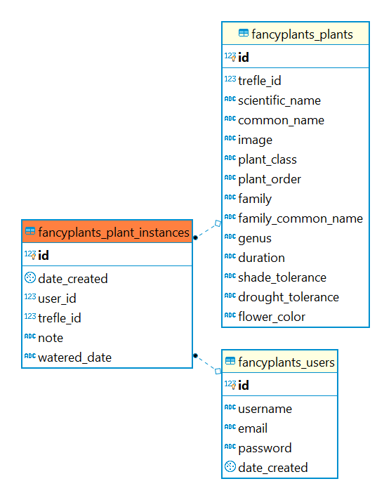

# Fancy Plants API

Fancy Plants is a plant management application for tracking a collection of plants, with access to one of the largest open plant databases on the web. Users can do research on plant species, add them to their collection, and use the features of the Garden dashboard to manage their plants.

## Technologies

| | | | | |
|-|-|-|-|-|
|**Front-End**|React|ES10|CSS3||
|**Back-End**|Node.js|Express|PostgreSQL|RESTful API|
|**Development**|Jest|Mocha|Chai|Heroku|Zeit|
| | | | | |

## Endpoints

### Authentication Endpoints
---

### `POST /api/user`

**Constraints**
```js
{
    username: 'string',
    email: 'valid@email',
    password: 'string'
}
```
**Response**

`Status: 200 OK`
```js
{
    username: 'string',
    email: 'valid@email',
    password: 'hashed_password'
}
```

---

### `POST /api/auth/login`

**Constraints**
```js
{
    username: 'string',
    password: 'hashed_password'
}
```

**Response**

`Status: 200 OK`
```js
{
    authToken: 'json-web-token'
}
```

**Invalid credentials response**

`Status: 400 BAD REQUEST`
```js
{ 
    error: `Invalid username or password` 
}
```

---

### Garden Endpoints
---

### `GET /api/garden`

**Constraints**

`Requires Auth`

**Response**

`Status: 200 OK`
```js
{
    instance_id: 123,
    scientific_name: '',
    common_name: '',
    image: '',
    watered_date: '',
    trefle_id: 123,
    note: ''
}
```

---

### `POST /api/garden`

**Constraints**

`Requires Auth`
```js
{   
    trefle_id: 123, 
    scientific_name: '', 
    common_name: '', 
    plant_class: '',
    plant_order: '',
    family: '',
    family_common_name: '',
    genus: '',
    duration: '',
    shade_tolerance: '',
    drought_tolerance: '',
    flower_color: '',
    image: '' 
}
```

**Response**

`Status: 201 CREATED`
```js
{   
    id: 123,
    date_created: '',
    user_id: 123,
    trefle_id: 123,
    note: '',
    watered_date: ''
}
```

---

### `PATCH /api/garden/:plant_instance_id`

**Constraints**

`Requires Auth`
```js
{   
    note: '',
    watered_date: ''
}
```

**Response**

`Status: 204 NO CONTENT`

---

### `DELETE /api/garden/:plant_instance_id`

**Constraints**

`Requires Auth`

**Response**

`Status: 204 NO CONTENT`

---

### Plant Endpoints
---

### `GET /api/plant`

**Constraints**

Requires a query string for lookup in the form of:
`q=string_to_look_up`

Example:
`/api/plant?q=almond`

**Response**

Responds with an array of plants matching that query string, sourced from the Trefle API.

`Status: 200 OK`
```js
[
    {
        "common_name": "almond willow",
        "complete_data": false,
        "id": 178202,
        "link": "http://trefle.io/api/plants/178202",
        "scientific_name": "Salix triandra",
        "slug": "salix-triandra"
    },
]
```
---

### `GET /api/plant/:plant_id`

**Constraints**

Requires a valid Trefle plant ID.

**Response**

Responds with an extensive object of plant details, sourced from the Trefle API.

`Status: 200 OK`
```js
{
    ...plantDetails
}
```
---

## Database Architecture

A shallow representation of each plant is cached in the local database for use by the garden endpoint.

<!-- ./resources/ -->


## Business Objects
<!-- The basic objects required for the application -->
- Users
    - id
    - username
    - email
    - password
    - date_created

- Plant_Instances
    - id
    - date_created
    - user_id
    - trefle_id
    - note
    - watered_date

- Plants
    - id
    - trefle_id
    - scientific_name
    - common_name
    - image
    - plant_class
    - plant_order
    - family
    - family_common_name
    - genus
    - duration
    - shade_tolerance
    - drought_tolerance
    - flower_color

## Developer Roadmap

1. Users can search for other users' gardens via GET /garden/:username
1. Users can leave comments on other users' gardens
1. Users can track the watering history of their plants
1. Many new features to the garden dashboard